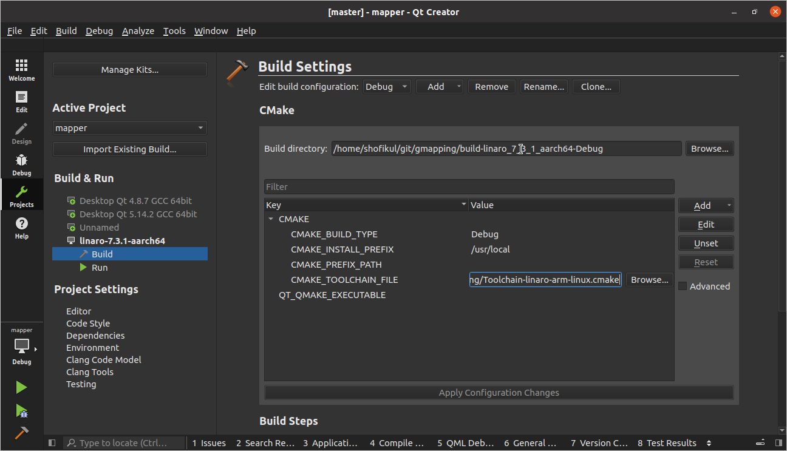

## Cross-compiling and Debugging with Qt creater

### Step 1: 
* **Download and extract** the [*Jetson Linux Driver Package Toolchain*](https://docs.nvidia.com/jetson/l4t/Tegra%20Linux%20Driver%20Package%20Development%20Guide/xavier_toolchain.html) file .
   
    
### Step 2:
* **Setup the Qt creator**  for debugging.

* For setting up Device Go to **Tools** => **Options** => **Devices** and **Add** a new device there
  
* Select **Generic Linux Device** and click **Start Wizard**

  
* Set up **Identity name**, **Devie's host name**, **username** and click the **Next** button
  
* Add **Private ssh key** and press **Next** button
   
* Press the **Finish** Button
   
* You can test the connection just click **Test**

   

* For setting up Kit Go to **Tools** => **Options** => **Kits** => **Compilers** and **Add** manually two compilers. One is for C++ that is **aarch64-liux-gnu-g++** and another one for C that is **aarch64-liux-gnu-gcc**
  
* Go to **Debuggers** and add a manual debugger that is **linaro-7.3.1-gdb**
  
* Now Go to **Kits** and **Add** a new Kit
  * Add a device name 
  * Select the Device type **Generic Linux Device**
  * Select the **Device** priviously added.
  * Select the C,C++ **Compiler** and the **Debugger** previously added
  * Press **Apply** and **OK** button
  

* Now in the left side go to **Projects** and Select the **Kit** previously added and go to **Build** and add the path of the cmake_toolchain file
  * **CMAKE_TOOLCHAIN_FILE = /home/shofikul/git/gmapping/Toolchain-linaro-arm-linux.cmake**
  
* Go to **Run** 
  * Setup **Alternate executable on device** path to **/home/ubuntu/bin/mapper**
  * Setup **Command line arguments** to **-filename /home/ubuntu/data/fr079-complete.gfs.log** 
  
